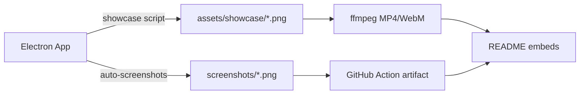

# 🧭 SONU Project Pathway
*Context-engineering single source of truth for automation, testing & visual-capture workflows*

---

## ⚡ 30-Second Context Snapshot
| Item | Value |
|------|-------|
| **Purpose** | Professional-grade **offline** voice-typing desktop app for Windows (Electron + Python) |
| **Core Tech** | Electron 28, Python 3.8+, faster-whisper, vanilla JS/CSS, Playwright |
| **Key Outputs** | `assets/showcase/*`, `screenshots/*`, `recordings/*`, `jest-*.json` reports |
| **Automation Scripts** | `npm run showcase` (Electron) vs `npm run auto-screenshots` (Playwright) |
| **Test Lanes** | unit → integration → e2e (Jest); flaky spots fixed with `setImmediate` polyfill & renderer hooks |
| **Next Milestones** | multi-language, Linux/macOS ports, plugin system |

---

## 🗂️ Decision Log (timestamped)
| Date | Decision | Rationale |
|------|----------|-----------|
| 2024-Q4 | faster-whisper instead of whisper.cpp | CPU-optimised, easy pip install, Hugging-Face mirrors |
| 2025-01 | Playwright over Spectron | Spectron deprecated; Playwright gives video + cross-platform |
| 2025-01 | `window.__rendererTestHooks` | Avoid async event wiring fragility in unit tests |
| 2025-01 | `setImmediate` polyfill | Electron E2E fails without it (Node≠renderer context) |
| 2025-01 | Dual automation paths | Showcase script = static PNGs for README; Playwright = MP4 + CI |

---

## 🚀 Automation Matrix
| Script | Command | Output Dir | Content | CI Ready |
|--------|---------|------------|---------|----------|
| **showcase** | `npm run showcase` | `assets/showcase/` | 17 PNGs + ffmpeg-ready MP4 | ✅ (local) |
| **auto-screenshots** | `npm run auto-screenshots` | `screenshots/` + `recordings/` | PNGs + walkthrough MP4 | ✅ (GitHub Action) |
| **banner** | `npm run banner` | `assets/showcase/banner.png` | composite banner | ✅ |

### ffmpeg Recipes (after showcase)
```bash
# MP4 montage
ffmpeg -y -framerate 1 -pattern_type glob -i "assets/showcase/*.png" \
       -c:v libx264 -pix_fmt yuv420p assets/showcase/showcase.mp4
# HEVC for social
ffmpeg -i assets/showcase/showcase.mp4 -c:v libx265 -crf 28 showcase_h265.mp4
```

---

## 🧪 Testing Runway
| Lane | Command | Key Fix Applied | Known Flaky Spot |
|------|---------|-----------------|------------------|
| **unit** | `cd tests && npm run test:unit` | renderer hooks exposed | `statWords` race (fixed via hooks) |
| **integration** | `npm run test:integration` | 30 s timeout + broader HTTP status | Hugging-Face mirror timeouts |
| **e2e** | `npm run test:e2e` | `setImmediate` polyfill in setup.js | Electron launch in CI |

### Renderer Test Hooks (unit/renderer.test.js)
```javascript
window.__rendererTestHooks = {
  updateStats,          // (stats) ⇒ update DOM
  addHistoryItem,       // (text)  ⇒ push to list
  updateStatsDisplay    // (stats) ⇒ refresh counters
};
```
Use these instead of waiting for IPC events.

### setImmediate Polyfill (tests/setup.js)
```javascript
global.setImmediate = global.setImmediate || ((fn, ...args) => setTimeout(fn, 0, ...args));
```

---

## 📊 Visual Asset Pipeline


---

## 🎯 Next Milestones & Blockers
| Milestone | Status | Blocker / Risk |
|-----------|--------|----------------|
| **Multi-language support** | planned | Need locale pipeline + model switching |
| **Linux & macOS ports** | planned | robotjs cross-platform QA |
| **Plugin system** | future | Secure preload sandboxing |
| **CI E2E stability** | in progress | GitHub runner Electron headless quirks |

---

## 🛠️ Quick-Start Cheat Sheet (for next AI engineer)
1. **Install**  
   ```bash
   npm install
   pip install faster-whisper pyaudio
   npx playwright install chromium   # for auto-screenshots
   ```

2. **Run app**  
   ```bash
   npm start
   ```

3. **Generate showcase assets**  
   ```bash
   npm run showcase                  # PNGs → assets/showcase/
   npm run auto-screenshots          # PNGs + MP4 → screenshots/ + recordings/
   ```

4. **Test everything**  
   ```bash
   cd tests && npm install
   npm run test:unit                 # must pass (hooks fix renderer)
   npm run test:integration          # bump timeout if mirror slow
   npm run test:e2e                  # add setImmediate polyfill if fails
   ```

5. **Troubleshoot fast**  
   - **PNG missing?** check selectors in `scripts/run-showcase.js` or `auto_screenshot.js`  
   - **MP4 corrupt?** re-run ffmpeg commands above  
   - **E2E timeout?** raise `jest.setTimeout(30000)` in failing suite  
   - **setImmediate error?** paste polyfill into `tests/setup.js`  

6. **Ship**  
   - Commit `assets/showcase/*` for README richness  
   - Commit `screenshots/*` + `recordings/*` only if CI artifact needed  
   - Update `PROJECT_PATHWAY.md` with any new decision or fix

---

*Last updated: 2025-01-07 v3.5.0*  
*Built with ❤️ using TraeAI IDE and AI assistance*